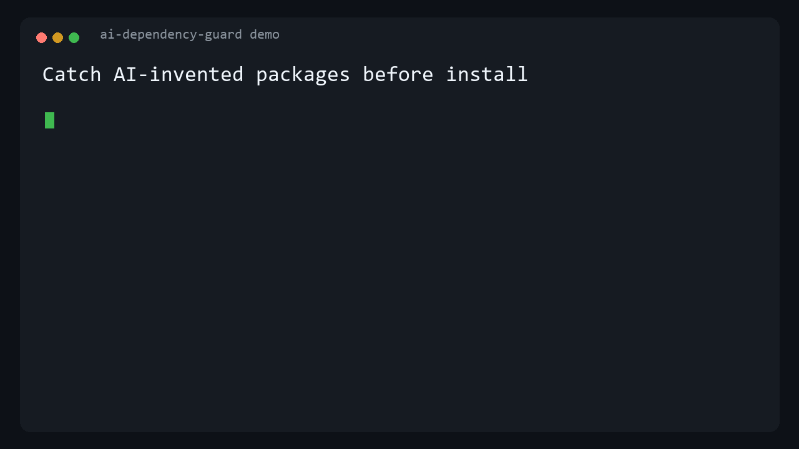

# ai-dependency-guard

Detect package dependencies hallucinated by AI coding tools before they reach your machine or CI.

AI assistants can suggest package names that sound plausible but do not exist. A package may later be registered under that name by an attacker. `ai-dependency-guard` checks references against public npm and PyPI registries and the public Go module proxy; it does not install or execute packages.



_The demo uses offline mode and never installs or executes a package._

> A package existing in a registry does not mean that it is safe.

## Quick start

Run from a checkout without installing runtime dependencies:

```bash
PYTHONPATH=src python -m ai_dependency_guard scan fixtures/broken-repo --offline
```

PowerShell:

```powershell
$env:PYTHONPATH = "src"
python -m ai_dependency_guard scan fixtures/broken-repo --offline
```

Example output:

```text
Found 2 dependency finding(s):
[WARNING] README.md:4 npm:definitely-not-a-real-package-12345
[WARNING] README.md:5 pypi:definitely-not-a-real-python-package-12345
```

For an installed CLI after publishing:

```bash
pipx install ai-dependency-guard
ai-dependency-guard scan .
```

## 15-second demo

From this checkout, run the scanner against the included broken fixture:

```bash
PYTHONPATH=src python -m ai_dependency_guard scan fixtures/broken-repo --offline
```

It immediately reports both fake package names with their exact file and line.

## GitHub Action

Add this workflow to a repository:

```yaml
name: AI dependency guard

on: [push, pull_request]

permissions:
  contents: read

jobs:
  scan:
    runs-on: ubuntu-latest
    steps:
      - uses: actions/checkout@v4
      - uses: ./
        with:
          path: .
          sarif-file: ai-dependency-guard.sarif
```

The local form above is copy-pasteable when `action.yml` is in the repository being scanned. After publishing, replace `./` with `OWNER/ai-dependency-guard@v1`. The Action adds annotations to affected files and fails when findings exist. It needs no API key. The optional `sarif-file` input writes a SARIF 2.1.0 report; upload it with GitHub's Code Scanning workflow if desired. The `cache-file` input can point to a workspace or runner cache; it is never written into the checkout unless explicitly configured.

### Action configuration

| Input | Default | Purpose |
| --- | --- | --- |
| `path` | `.` | Repository directory to scan. |
| `offline` | `false` | Skip registry requests and report unknown status. |
| `fail-on` | `any` | Use `none` to report findings without failing the step. |
| `ignore-paths` | empty | Comma-separated relative paths or globs. |
| `ignore-packages` | empty | Comma-separated package names. |
| `cache-file` | runner temp file | Explicit registry cache path. |
| `sarif-file` | empty | Optional SARIF output path. |

## CLI

```text
ai-dependency-guard scan [path]
ai-dependency-guard scan [path] --json
ai-dependency-guard scan [path] --sarif
ai-dependency-guard scan [path] --sarif-file results.sarif
ai-dependency-guard scan [path] --offline
ai-dependency-guard scan [path] --ignore-package PACKAGE
ai-dependency-guard scan [path] --ignore-path 'fixtures/**'
```

Exit codes:

| Code | Meaning |
| --- | --- |
| `0` | No findings, or `--fail-on none` |
| `1` | Findings detected |
| `2` | Invalid input or internal error |

The scanner skips `.git`, `node_modules`, virtual environments, build output, and other generated directories. It does not run package managers, shell scripts, project code, or registry install hooks.

## What it checks

- npm dependency sections in `package.json`.
- Python dependencies in `requirements.txt` and `pyproject.toml`.
- Install commands in Markdown, agent instruction files, shell scripts, PowerShell, YAML, and JSON configuration.
- Public npm and PyPI package existence.
- Go requirements and applicable replacements in `go.mod`, including requested versions and source locations.
- Optional JSON and SARIF reports for CI tooling.

Registry lookup failures remain visible as errors; they are never treated as a clean result. Offline mode deliberately reports unknown status for each package reference.

### Go module lookup behavior

Go requirements are checked using `/$module/@v/$version.info`, rather than treating
an existing module's version list as proof that every requested version exists.
Both canonical tagged versions and pseudo-versions use this metadata endpoint.
Module paths and versions retain their case and use the Go proxy's uppercase escaping.
The response must be HTTP 200 with a JSON object containing the exact canonical
`Version` requested and a valid RFC 3339 `Time` if that optional field is present.
Invalid metadata is a visible lookup error and is not cached. Noncanonical revision
names, shorthand versions, and build metadata other than `+incompatible` are not
resolved by this scanner; they produce a lookup error rather than a clean result.
Resolve those versions with Go tooling before scanning.

Exact-version checking is a deliberate extension of module-name existence checking.
It checks declarations, not the final versions a Go build selects. This is not a
full Go module resolver or a guarantee that dependencies are safe.

Local-directory replacements are skipped. Applicable remote replacements are
checked using their replacement module and version, with findings pointing to the
`replace` directive. Version-specific replacements take precedence over wildcard
replacements; replacements are not chained. Unused replacements are not dependencies.
Conflicting repeated replacements are file-parse errors; identical repeats are allowed.
An `--ignore-package` rule matches either the declared module name or the effective
replacement name before any lookup. Existing case-insensitive ignore behavior is
preserved. Findings continue to point to the effective replacement's source line.

The optional cache separates Go results by module path and requested version.
Cache schema 4 invalidates older Go entries, including schema 3 results that did not
validate `.info` responses, while retaining valid npm and PyPI entries. HTTP 404 and 410 mean the module or version was not found on the
public proxy, not that it cannot exist privately or elsewhere. Rate limits and
network failures remain visible errors; offline scans remain unknown even when a
cached result exists. No Go commands are run and no module archives are downloaded.

The two-argument `PublicRegistryClient.check(ecosystem, name)` interface remains
available for module/package existence checks. Supply `version` for a Go version
lookup, as the scanner does for `go.mod` references.

## Threat model

The tool is designed to catch a package name that an AI assistant invented or mistyped before a developer installs it. It treats a missing registry entry as a high-signal finding and keeps registry failures visible as error findings.

It does not determine whether an existing package is malicious, compromised, typosquatted, or vulnerable. It is not a malware scanner and does not replace lockfile review, dependency auditing, or package provenance checks.

## Privacy

- No LLM, paid service, credential, or API key is required.
- Online scans contact public npm and PyPI package endpoints and `proxy.golang.org`.
- Go lookups send the module path and requested version to the public proxy. `GOPRIVATE` is not read; exclude private modules with `--ignore-package` or `--ignore-path` before scanning.
- Package contents are not downloaded or executed.
- Secret values are not included in findings or cache entries.
- The default scan is read-only. An explicit `--cache-file` may be used to persist registry status outside the scanned repository.

## Limitations

- npm and PyPI checks verify package existence, not requested versions. Go checks verify requested module versions.
- Go workspace overrides (`go.work`) and full transitive dependency resolution are not implemented.
- A package referenced through an unusual command wrapper or generated dynamically may not be detected.
- Registry availability, rate limits, and package renames can affect results; unknown is never treated as clean.
- A package existing in a registry does not mean that it is safe.

## Development

```bash
PYTHONPATH=src python -m unittest discover -s tests -v
PYTHONPATH=src python -m ai_dependency_guard --help
```

The test suite uses mocked registry responses and does not require network access.

Contributions are welcome. See [CONTRIBUTING.md](CONTRIBUTING.md) and [SECURITY.md](SECURITY.md).

## License

MIT. See [LICENSE](LICENSE).
